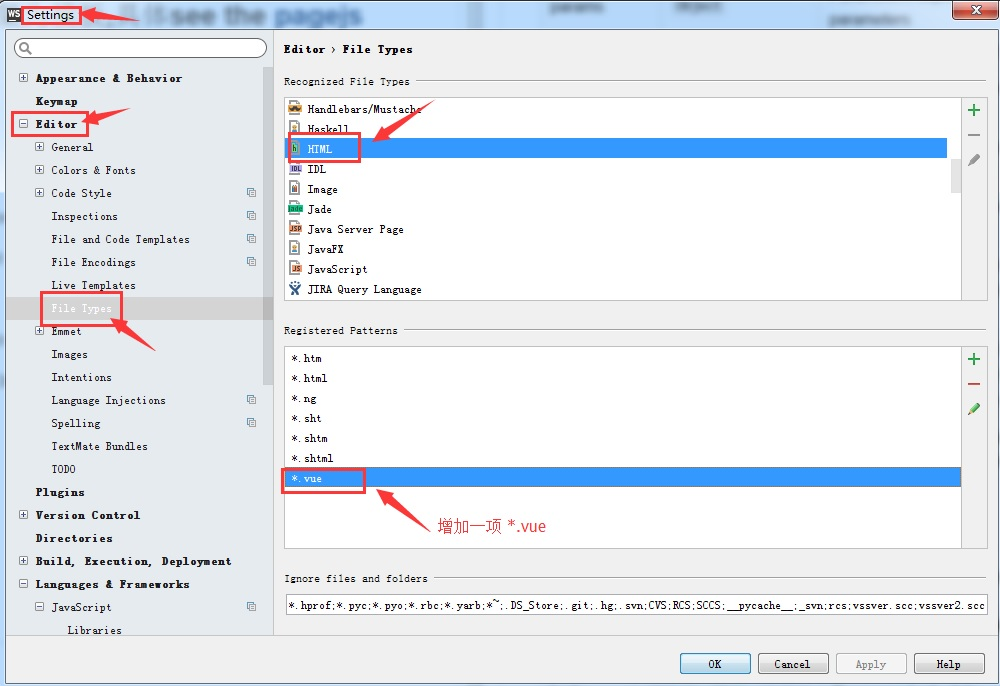
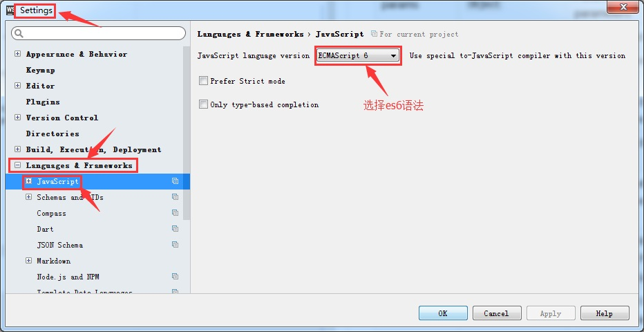
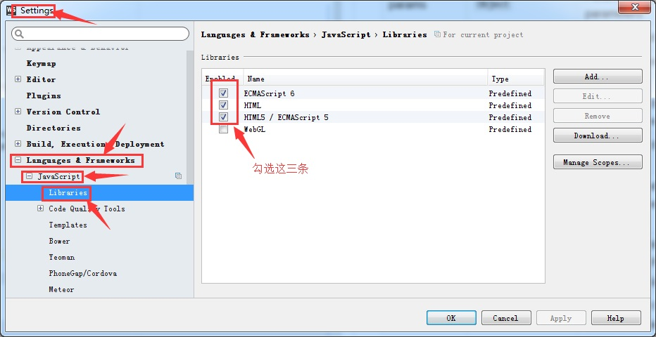
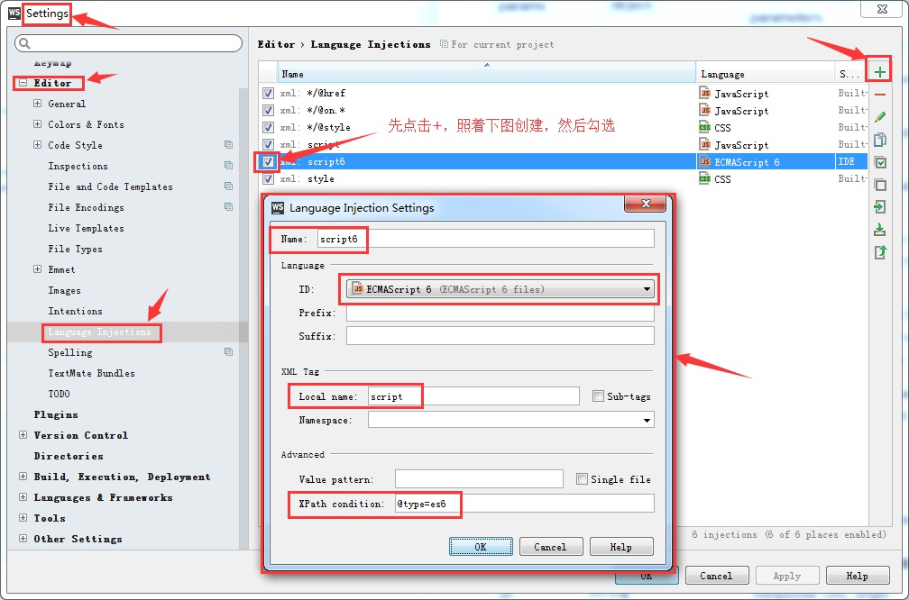

[<< readme](../README.md)
# webstome配置

1. file>settings>Editor>File Types
> 在右侧列表框中找到html，然后为其添加一个pattens： *.vue
   
  
2. file>settings>Languages & Frameworks>javascript
> js版本选择es6
  
  
3. file>settings>Languages & Frameworks>javascript>Larbries
> 勾选HTML、勾选ECMAScript 6、勾选HTML5/ECMAScript5
  
  
4. file>settings>Editor>Language Injections
> 点击加号，选择Generic Js
  在弹出的面板中，填写以下信息：
  Name: Es6
  ID: ECMAScript 6
  Local name: script
  XPath condition: @type=es6
  完成后在这一条上打上勾
  